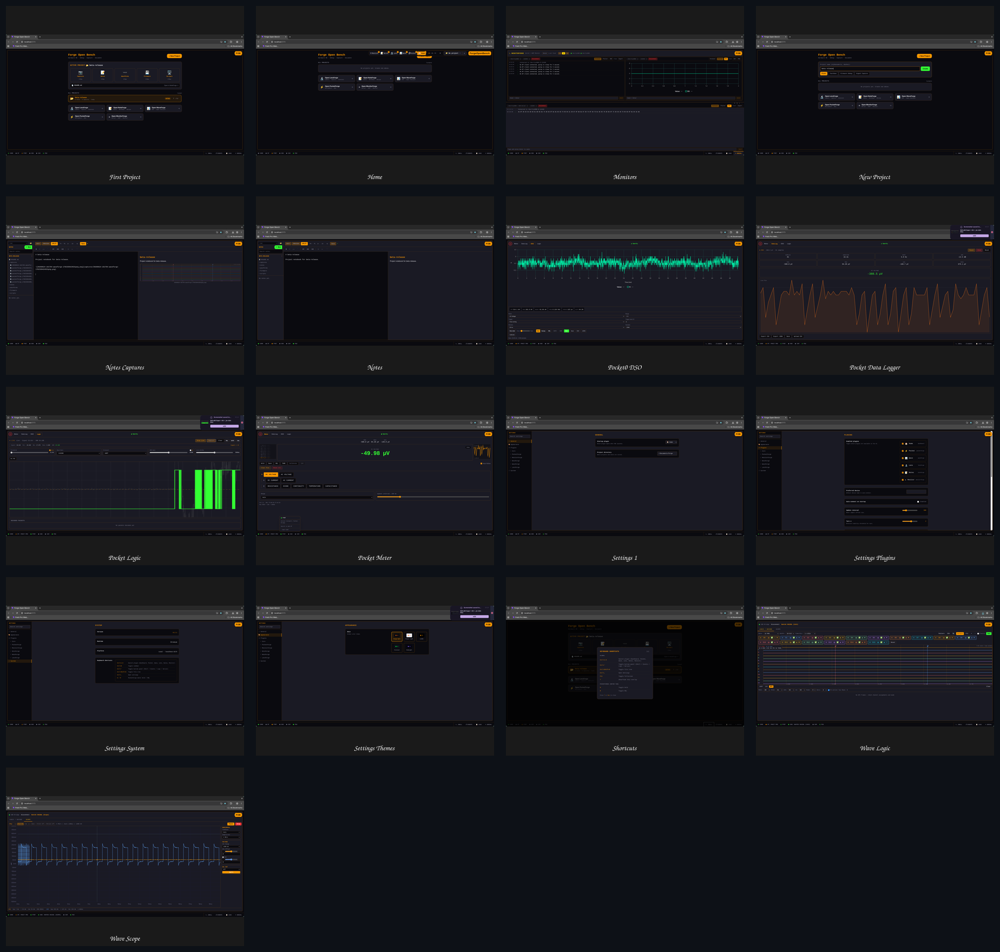
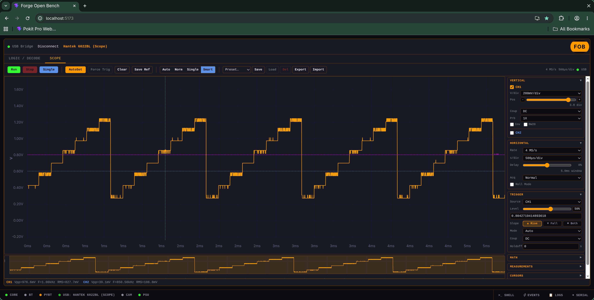
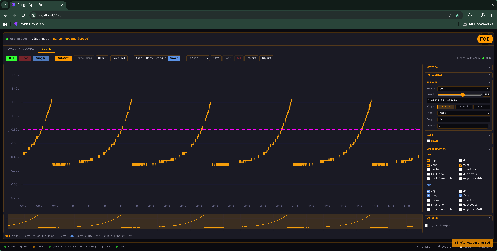

# Forge Open Bench

> **Your bench. Your browser. Your data.**  
> A local-first hardware instrumentation workbench that turns a laptop, Raspberry Pi, or single-board computer into a proper electronics lab — no cloud, no telemetry, no subscriptions, no account required. A phone or tablet on the same network can use the web UI as a remote display, but the FOB server must run on a real PC or SBC.

---

## What Is This Thing?

**Forge Open Bench (FOB)** is a browser-based control panel for real bench hardware. Plug in a multimeter, logic analyzer, or oscilloscope, open `localhost:5173`, and you get a unified, professional-grade interface that looks like it belongs on a $5,000 Keysight rig — except it runs in Chrome and costs exactly zero dollars.

It is built for two kinds of people:

- **The hardcore engineer** who needs a fast, scriptable, keyboard-driven toolchain that talks directly to sigrok, libusb, and BLE GATT without wrapping it in three layers of Electron bloat.
- **The curious beginner** who just bought a Pokit Pro or a $40 Hantek clone off Amazon, plugged it in, and thought: *"Okay, now what?"*

FOB is the *"now what."*

---

## What You Can Do Right Now

| Plugin | What It Does | The Vibe |
|---|---|---|
| **PocketForge** | Connect a Pokit Pro or Pokit Meter over Bluetooth. Real-time multimeter, data logger, and a 1-channel oscilloscope (Pokit Pro) with CRT-style phosphor persistence, REL/GATE/SNR math, and Vpp/Freq/RMS overlays. | Your pocket multimeter just became a bench scope. |
| **WaveForge** | Hook up a Hantek 6022BL. **DSO mode:** 2-channel oscilloscope with live capture, Autoset, FFT with peak markers, XY mode, digital phosphor with intensity control, draggable A/B cursors, reference waveforms, math channel, measurements panel, named presets, CSV/PNG export. **LA mode:** 16-channel logic analyzer with live rolling capture, draggable cursors, pan/zoom, UART/I2C/SPI decoders, CSV/VCD export. | PulseView, but it does not make your CPU cry. |
| **LensForge** | Point any USB or IP camera at your board. Multi-pane live video with per-pane focus/exposure controls, SVG annotation layers (crosshair, grid, reticle), one-click snapshots, and video recording into your project folder. | Your USB camera is now a lab microscope with markup. |
| **NoteForge** | Write markdown project notes with wiki-links (`[[Like This]]`), full-text search, canvas snapshot embeds, and auto-generated project READMEs. Think Obsidian, but it knows what hardware you just captured. | Engineering notebook that auto-links your captures. |
| **Dashboard** | Project switcher, hardware health at a glance, template-based project creation, and one-click `.zip` export. | The home screen your bench deserves. |
| **Settings** | Skin picker, startup plugin, workspace path, plugin preferences. | The control panel. |
| **MonitorForge** | Multi-pane serial monitor with hex/ASCII toggle, timestamps, baud selection, and manual port rescan. | `Serial.print()` finally gets a UI. |

---

## Screenshots



### WaveForge DSO





---

## The Hardware You Already Own

FOB speaks to the gear on your desk, not the gear in a SaaS pricing tier.

| Device | Interface | What FOB Sees |
|---|---|---|
| **Pokit Pro / Pokit Meter** | BLE (Web Bluetooth or Python bridge) | Full multimeter + 1-ch DSO + data logger. Low latency on Linux via the Python bridge. |
| **Hantek 6022BL** | USB (sigrok fx2lafw) | 2-ch DSO + 16-ch LA in one $40 dongle. Firmware switching handled automatically. |
| **Hantek 6022BE** | USB (sigrok hantek-6xxx) | Classic 2-ch DSO. No firmware dance required. |
| **Saleae Logic clones** | USB (sigrok fx2lafw) | Should work out of the box. |
| **Any USB / IP webcam** | V4L2 / OpenCV | Instant bench camera with manual focus and exposure control. |
| **Serial devices (Arduino, ESP32, RP2040)** | USB UART | MonitorForge reads `Serial.print()` output with timestamps and hex mode. |
| **Rigol / Siglent SCPI scopes** | USB / LAN | Planned for v1.2. |

> **Pro tip for 6022BL owners:** This device is weird. It shows up as a Saleae Logic clone (`0925:3881`) in logic analyzer mode, but it is actually a 16-channel Hantek. Press the **H/P** button to toggle between LA and scope mode. FOB handles the firmware switch for you in Settings → WaveForge. You do not need to `sudo cp` anything.

---

## Quick Start (Five Minutes to First Signal)

### One-Line Install

```bash
git clone https://github.com/vailuc/ForgeOpenBench.git
cd ForgeOpenBench
chmod +x install.sh && ./install.sh
```

`install.sh` is idempotent. It detects your OS (Debian, Ubuntu, Arch, macOS, Raspberry Pi OS), installs Node.js, Python, sigrok-cli, sets up a udev rule for the Hantek, creates a Python virtual environment, installs npm packages, and offers to make a `.desktop` launcher. **Continuous integration and daily use are currently verified only on Arch Linux.** Other distros and macOS/Windows (including WSL) are expected to work but remain to be fully tested and proven by the community.

> **udev / USB permissions:** The install script copies `99-waveforge.rules` to `/etc/udev/rules.d/` and sets `MODE="0666"`, so the device is accessible by any user. The rules also reference `GROUP="plugdev"`; if your distro (e.g. Arch) does not have that group, the script creates it and adds you to it. Being in both `plugdev` and `uucp` is fine and does not conflict. You may need to log out and back in for the group change to take effect.
>
> **Rust DSO capture binary:** The source for the scope-mode USB capture helper is in `server/usb-bridge/hantek-capture/`. `install.sh` builds it automatically if `cargo` is installed; otherwise it uses the pre-built binary in the repo. Paranoid users can rebuild it and compare the hash to verify the binary is clean.

### Launch

```bash
./launch.sh
```

Open **http://localhost:5173** in Chrome. (Chrome is required for Web Bluetooth. Firefox and Safari users: the Python BLE bridge still works.)

### Launch Options

```bash
./launch.sh --dev          # hot-reload backend + all bridges + Vite dev server
./launch.sh --no-bridge    # skip BLE bridge (no Pokit on this machine)
./launch.sh --no-usb       # skip USB bridge (no Hantek on this machine)
./launch.sh --no-frontend  # skip Vite dev server (backend serves frontend/dist)
./launch.sh --shutdown     # stop every FOB process cleanly
```

### Running Manually (Advanced)

If you want to see what is under the hood, run each service in its own terminal:

```bash
source .venv/bin/activate

# BLE bridge (Pokit Pro) — Python sidecar that bypasses Chromium's BLE batching
python server/pokit-bridge/pokit_server.py

# USB bridge (Hantek / sigrok) — talks libusb and sigrok-cli
python server/usb-bridge/usb_server.py

# FastAPI backend — notes, settings, projects, camera proxy, terminal PTY
uvicorn backend.app:app --reload --port 8000

# Frontend — Vite + React + TypeScript
cd frontend && npm run dev
```

---

## How It Fits Together

```
Browser (React + Vite :5173)
  ├── PocketForge ──► Web Bluetooth ──────────────────► Pokit Pro
  ├── PocketForge ──► WebSocket :8765 ──► pokit_server.py (bleak)
  ├── WaveForge   ──► WebSocket :8766 ──► usb_server.py (sigrok / native USB)
  ├── LensForge   ──► HTTP /api/v1/camera ──► OpenCV / V4L2
  └── All plugins ──► HTTP /api/v1   ──► FastAPI :8000
                                           ├── notes, settings, projects
                                           ├── WS /api/v1/events (control plane)
                                           └── PTY /api/v1/system/terminal
```

All WebSocket URLs resolve dynamically from `window.location.hostname`. This means you can run FOB on a Raspberry Pi or lab PC, open `http://pi.local:5173` from any browser on the same network — including a phone or tablet — and operate the scope from across the room. The browser is a remote display; the FOB server and USB/BLE hardware must stay on the host machine.

### Why Two BLE Transports?

| Mode | Stack | Best For |
|---|---|---|
| **Web Bluetooth** | Chrome → BlueZ | macOS and Windows via browser; quick pairing, no Python dependencies. Linux is the only platform tested and proven. |
| **Python Bridge** | `bleak` → BlueZ → WebSocket | Linux. Bypasses Chromium's 135–150 ms BlueZ notification batching. |

The Python bridge is a small `bleak` WebSocket server. It exists solely because Chromium on Linux batches BLE notifications into 150 ms chunks, which makes a live DSO trace look like a slideshow. The bridge delivers notifications as fast as the hardware emits them. You switch transports in the footer bar with one click.

---

## Project Structure

```
ForgeOpenBench/
├── install.sh              — one-shot setup (deps, venv, udev, npm, .desktop)
├── launch.sh               — service orchestrator (start/stop/dev/no-* flags)
├── backend/                — FastAPI app (notes, settings, camera, events, terminal)
├── frontend/src/
│   ├── core/               — event bus, plugin loader, settings store, skin system
│   ├── shared/             — shell components (header, sidebar, footer, bottom panel)
│   └── plugins/            — dashboard, pocketforge, waveforge, lensforge,
│                             noteforge, settings
├── server/pokit-bridge/    — Python BLE bridge (bleak → WebSocket)
├── server/usb-bridge/      — USB instrument bridge (sigrok → WebSocket)
│                             + native Rust/C capture module for DSO streaming
└── docs/                   — hardware guide and architecture notes
```

---

## For the Engineer: What Is Under the Hood

- **Frontend:** React 18, Vite, TypeScript (strict), Tailwind CSS, uPlot for waveforms, xterm.js for the shell, react-markdown for notes. Zero TypeScript errors in production build. Clean `npm run build`.
- **Backend:** FastAPI, uvicorn, pydantic. Async everywhere. File I/O is path-traversal guarded. Terminal WebSocket is loopback-only (code 1008 for remote connections).
- **USB Capture:** For Hantek DSO mode at 4–15 MS/s, a native `hantek-capture` module (C/Rust + libusb async) streams raw bulk transfers over a UNIX socket. Python bridge forwards binary WebSocket frames. Frontend parses `ArrayBuffer` directly into `Float32Array` — zero-copy.
- **BLE:** Dual-transport abstraction (`IPokitConnection`). Auto-reconnect with exponential backoff. GATT collision avoidance on tab switches. Sequential characteristic reads with settle delays to avoid firmware lockups.
- **Plugin System:** Runtime-loaded plugins with isolated error boundaries. One crashing plugin cannot take down the app. Each plugin gets a `PluginBus` for scoped events and the `globalBus` for cross-plugin signals.
- **Theming:** 5 skins (Forge Dark, Forge Light, LCARS, Terminal, Midnight) via CSS custom properties. Skin rehydrates before first paint — no flash on reload.

---

## For the Beginner: What You Need to Know

**Do I need to know React?** No. FOB is a finished application. You install it, run it, and use it.

**Do I need to know Python?** Only if you want to hack on the backend or write automation scripts. The install script handles Python for you.

**Do I need Linux?** No, but Linux is the only platform tested and proven day-to-day. macOS and Windows (including WSL) are expected to work, but the project has not yet validated them. If you get them running, PRs and issue reports are welcome.

**Is my data safe?** Yes. FOB is local-first. Your captures live in `Projects/`. Your notes live in `Projects/<name>/README.md`. No cloud. No telemetry. No account. You can run it on an air-gapped machine with no network at all.

**Can I use this for my Arduino project?** Absolutely. PocketForge meters your power rails. WaveForge watches your I2C/SPI buses. LensForge zooms in on your soldering. NoteForge documents what you changed. MonitorForge reads your `Serial.print()` output.

**Affiliation / compliance:** Forge Open Bench is an independent, community project. It is not affiliated with, endorsed by, or certified by Pokit Innovations, Hantek, Saleae, sigrok, or any other hardware or software vendor. It is not IEC, UL, CE, or safety certified and must not be used as a certified measurement instrument. Always follow your device's safety ratings and use an isolated, rated instrument when mains or high-energy circuits are involved.

**What if something breaks?** Open the bottom panel (`Ctrl+'`), click the **Events** tab, and read what the backend said. Every plugin emits structured events. Every error is a toast notification. We have spent an unreasonable amount of time making sure the error messages actually tell you what went wrong.

---

## Keyboard Shortcuts

| Shortcut | Action |
|---|---|
| `Ctrl+1–6` | Switch plugins (Dashboard, PocketForge, WaveForge, LensForge, NoteForge, MonitorForge) |
| `Ctrl+'` | Toggle bottom panel (Shell / Events / Logs / Serial) |
| `Ctrl+Shift+E` | Toggle file tree |
| `Ctrl+,` | Open Settings |
| `F11` | Toggle fullscreen |
| `?` | Show / hide shortcuts overlay |
| `H` / `R` | Hold / REL toggle (PocketForge Meter tab) |

---

## Development

```bash
cd frontend
npm test          # vitest unit tests
npm run build     # production build — must exit 0 with zero TS errors
```

The frontend build is clean. `tsc --noEmit` + `vite build` both pass. This is not a suggestion; it is enforced.

---

## Roadmap

See [`docs/ROADMAP.md`](docs/ROADMAP.md) for the full engineering roadmap. In short:

- **v0.9.x** — Release candidates. All core plugins feature-complete, build clean, installable in under 5 minutes.
- **v0.9.1** — Final release candidate. Sanitized release tree, ready to ship.
- **v1.0** — Product identity. Responsive mobile layout, first-run wizard, polished chrome. FOB feels like a real product.
- **v1.1** — Protocol decoders for DSO, SCPI instrument support, serial monitor maturity.
- **v1.2** — Platform. Plugin SDK, API docs, telemetry opt-in, commercial licensing path.
- **v2.0** — *(future, unscoped)* Multi-device sync, shared capture URLs, multi-user bench sessions.

---

## License

This project is licensed under the GNU Affero General Public License v3.0 — see the [`LICENSE`](LICENSE) file for full terms.

Commercial bench seat licensing, support, and custom plugin development are available on request for corporate labs, defense contractors, and educational institutions.

---

## Acknowledgments

FOB stands on the shoulders of giants:

- **[sigrok](https://sigrok.org/)** — the open-source signal analysis project that makes cheap USB instruments usable
- **[bleak](https://github.com/hbldh/bleak)** — the Python BLE library that makes cross-platform Bluetooth bearable
- **[uPlot](https://github.com/leeoniya/uPlot)** — the 6 KB charting library that draws waveforms faster than your scope updates
- **[xterm.js](https://xtermjs.org/)** — the terminal emulator that powers the in-app shell
- The **Pokit Innovations** team for building a multimeter that exposes a sane BLE GATT interface

---

> *"The best instrument is the one you actually use."*  
> — Every engineer who has ever watched a $300 scope collect dust because the software was worse than the hardware.
